# FBAuthentication

## Introduction

A Swift Package for implementing a turnkey solution for signing up and signing in to Firebase using **email/password** or **apple**.

Solution facilitates ability to request **password reset** for email/password sign in as well as **account deletion** for both.

Watch this video and/or follow the documentation.

<iframe width="560" height="315" src="https://www.youtube.com/embed/f480NQwvz7E" title="YouTube video player" frameborder="0" allow="accelerometer; autoplay; clipboard-write; encrypted-media; gyroscope; picture-in-picture" allowfullscreen></iframe>

[TOC]

## Create Your Xcode Project

The first thing you need to do is to create a Firebase project.

### Copy the Bundle Identifier

Once you have created your Xcode project where you want to install the Firebase Authentication Package, you will need your BundleID.  Make sure that your domain is us used for your project.


## Create the Firebase Project

The next step is to log in to the Firebase Console by going to https://firebase.google.com and then, on the top right of the menu bar, make sure you are logged in with your google account and click on **Go to console**


Once there, depending on whether or not you have ever created a project or not, you will see one of these two buttons

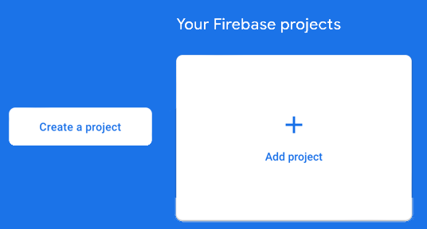

Click on one of them to create a new project.

1. Give your app a name (I usually give it the same name as my Xcode project) then click on **Continue**
2. At the next screen, I am not going to add Google Analytics so I will turn this off.  
3. Next, cl on **Create Project**.  Your project will now be set up and a progress wheel will show you the process and then display a **Continue** button when completed.

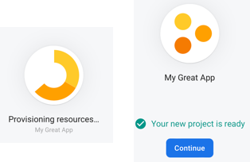

4. When the project window is displayed, you need to add your Xcode iOS App to the project, so click on the **iOS** button to get started.

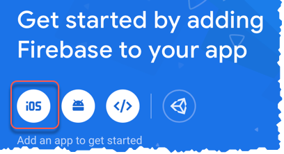

5. Enter the required information:
   1. **Bundle ID:** Copy the Bundle Identifier from your Xcode project (See above) and paste it into this field.
   2. Enter a name for your app (I generally use the same name as the app again)
   3. Click on **Register App**

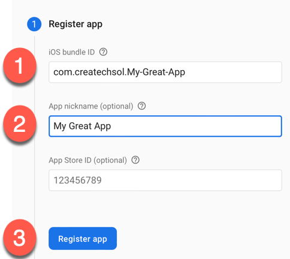

6. At the next screen, click on the **Download GoogleServices-info.plist** button to download the plist and drag it into your Xcode project navigator.  Make sure you specify to copy items if needed then click on **Next**

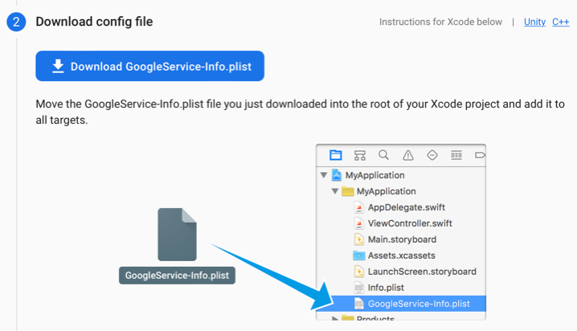

7.  Return to the console and click on **Next**.
8.  You can ignore the next screen where is talks about installing the SDK,  I will be covering that next, so simply click on **Next** and then on the next screen, **Next** again until you reach the screen that has the 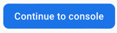 and click on it to go to the console.

## Add Authentication and Clouds Firestore

Your app now needs to have both **Authentication** and **Firestore Database** added.

#### Authentication

1. Click on  in the menu at the side of your app console.

2. On the next screen, click on **Get Started** and then on the following screen, you can enable **Email/Password** and **Apple**

   ##### Email/Password

   Click on 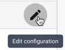beside Email/Password and on the next screen, click on **enable** and then click on **Save**.

   ##### Apple

   Repeat for **Apple**.  There is no need to do anything else for sign in with apple on the console, but you will have to configure your Xcode application.  That will be the next step.

#### Firestore Database

1. Click on  in the menu at the side of your app console

2. At the next screen, click on **Create Database**

3. You can choose to start your app in **test mode** but you will eventually need to configure the security rules within 30 days.  Choose this option initially and then click on **Next**

4. I usually leave the Firestore location at the default selected and then click on **Enable**.  The provisioning of the database will now begin.  Once it has completed, your configuration in the Firebase console for this app is now completed but you must first copy your Project id

5. Return to the app console and click on the Project Overview gear icon and choose Project Settings** 

6. Copy and save if necessary your **Project ID**

   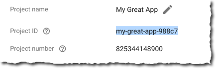

7. And while you are at it, if you have not done so already, change the Public-facing name to one that will reflect your app.  This name will be used in the **reset password** email.

   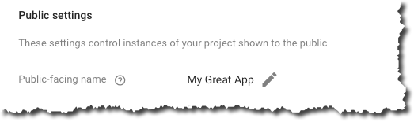

## Enabling your Xcode application for Sign in with Apple

The final step before we add the Swift package is to enable your application for Sign In with Apple.

### Apple Developer Account

1. Log in to your Apple Developer account at https://developer.apple.com 

2. Click on **Certificates, IDs and profiles**

3. At the next screen, click on **More** then **Configure**

4. Click on the **+** besides  to registern an new **email source**.

   The format is always the same, 

   `````swift
   noreply@<ID>.firebaseapp.com
   `````

   So in my case, I enter noreply@**my-great-app-988c7**.firebaseapp.com then click on **Next** and then **Resister** and finally **Done**.

### Xcode app signing capabilities

1. Return to your Xcode project now and click on your project to select the target

2. Click on the **Signing & Capabilities** tab and click on the **+** button to add a new capability

   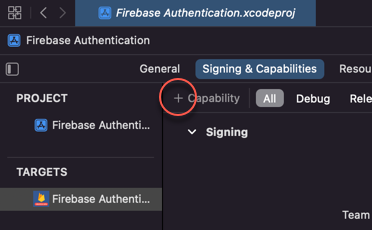

3. Filter and add Sign In with Apple

   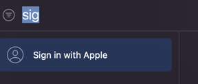

## Add the FBAuthentication Package to Xcode

You can now add the **FBAuthentication** package to your Xcode project

1. From the **File** menu, choose **Add Packages..**

2. On the following screen, search for the package URL 'https://github.com/StewartLynch/FBAuthentication' and when found, click on **Add Package**
   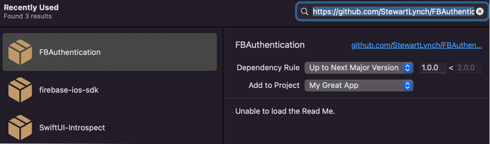

   The process will start to verify that it is available and eventually you will be presented with this screen where you can simply click on **Add Package** once again.
   
   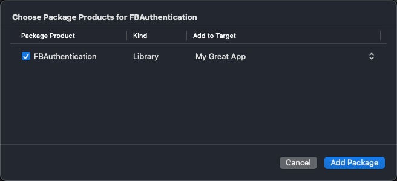

All of the required dependencies will then be added to your project.  In particular, note the **FBAuthentication** dependency.  This is the one that contains all of the views, classes and structs related to the Firebase authentication process.

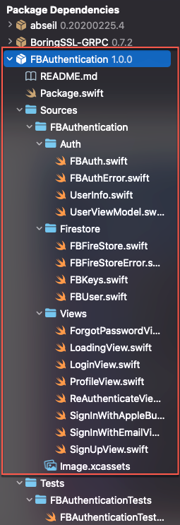

At this point, I also recommend that you Build your app

## Configure Firebase

1. In the start point for your app (the file marked with  **@main**, add

`````swift
import Firebase
import FBAuthentication
`````

2. Create an initializer for your app struct and within the initializer, add the FirebaseApp configure function

   `````swift
   init() {
       FirebaseApp.configure()
   }
   `````

3. Inject an instance of the UserInfo object into the environment.  This object is part of the FBAuthentication package and is a ViewModel that contains an instance of a **FBUser** that will be used to log in to Firebase using the the specified authentication method (email or apple) and will store the FBUser.name (the person's name) in a FireStore user collection.
   It also maintains the authentication state and watches for changes.

   `````swift
   ContentView().environmentObject(UserInfo())
   `````

   The final stuct will look something like this
   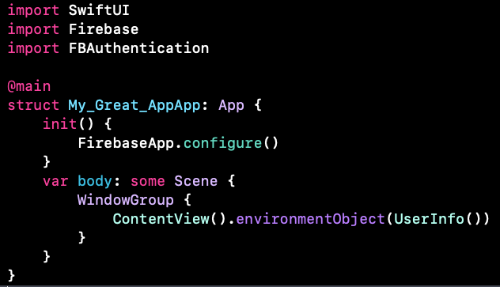

## Designing your Start View

Before you can implement the Authentication process, you have to design a SwiftUI view that will be the starting point for your application once the authentication has completed.  You can give your start view any name you like, but for testing purposes I am am going to call my view, **HomeView**

1. import **FBAuthentication**
2. Create an EnvironmentObject for our userInfo
3. Change the text view to display the **userInfo.user.name**

`````swift
import SwiftUI
import FBAuthentication

struct HomeView: View {
    @EnvironmentObject var userInfo: UserInfo
    var body: some View {
        Text("Logged in as \(userInfo.user.name)")
    }
}

struct HomeView_Previews: PreviewProvider {
    static var previews: some View {
        HomeView().e
    }
}
`````

## Update ContentView

The final stage before testing is to update ContentView

This is where the power of FBAuthentication shines.

1. import FBAuthentication
2. Create an EnvironmentObject for userInfo
3. change the body to be a instance of LoadingView, passing in the HomeView you created as the startView
4. Stop the preview from complaining, but adding in an instance of UserInfo into the the environment

`````swift
import SwiftUI
import FBAuthentication

struct ContentView: View {
    @EnvironmentObject var userInfo: UserInfo
    var body: some View {
        LoadingView(startView: HomeView())
    }
}

struct ContentView_Previews: PreviewProvider {
    static var previews: some View {
        ContentView().environmentObject(UserInfo())
    }
}
`````

## Test

You are at the point now where you can test the functionality so far.

### Create an account using Sign Up

1. Run the application in the simulator.
2. At the login screen, tap on the **Sign up** button then enter your full name and a valid email and password and tap on **Register**.
   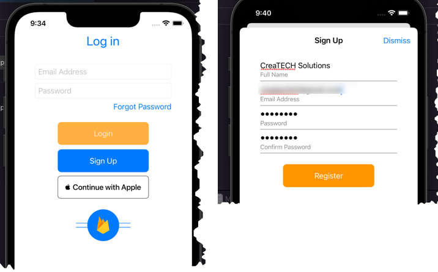

Upon a successful log in, you will be taken to your **Home** screen and the text view in the center will display the name that you entered when signing up

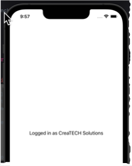

3. Stop running your app and run it again. You will find that you will not have to log in again.  Your login status will remain as logged in until you issue a log out command.

### Verify Firebase Console

Log in to your Firebase console to verify that an authentication and a user record has been created for your application.

#### Authentication

In your project, on the Authentication tab you will see an entry for your newly created user.  This record is for authentication only.  It will display a record showing an envelope icon designating this as a record created using sign in with email/password

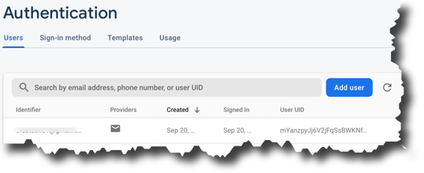

#### User Collection

A new **User** collection has been created in the Firestore database along with a record for this account. If you access the **Firestore Database** tab you will be able to drill down on your data to see the users collection along with a single document.  This document represents the user and if you click on it, you will see the three fields that are stored in this collection.

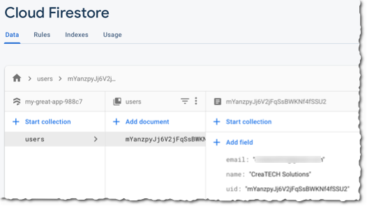

> **Note:** For ease of management, it is recommended that you create all new collections as sub collections of the user.  That way, you will be able to delete a user and all corresponding data will be deleted along with it.

### Create a Log Out Button

Somewhere within your app, and I recommend the Home View, create a button that will handle the log out function.  

1. For testing purposes, embed your textView in a VStack and create the button below it, calling the Logout function like this.

`````swift
struct HomeView: View {
    @EnvironmentObject var userInfo: UserInfo
    var body: some View {
        VStack {
            Text("Logged in as \(userInfo.user.name)")
            Button {
                FBAuth.logout { result in
                    switch result {
                    case .success(_):
                        print("Logged out")
                    case .failure(let error):
                        print(error.localizedDescription)
                    }
                }
            } label: {
                Text("Log Out")
            }
        }
    }
}
`````

2. Run the app once more and tap on the Log Out button.  You should be taken directly to the **Login View**.

### Create an account using Continue with Apple

To test and verify the signup with apple, you must run the application on a device.

1. Tap the **Continue with Apple** button
2. At the next screen, you can choose to share your name and choose to share either your email address or hide your email.  Make your choose and tap on **Continue** to be taken to the home view

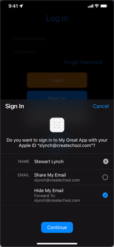

3. Tap on Log Out to return to the login Screen
4. Tap on the **Continue with apple** button once more but this time you will be presented with only the option to continue


#### Verify Account and User collection created on Firebase Console.

Return to your Firebase console and verify that there are new entries in the Authentication tab and a new document has been added to the User collection in Firestore.

Notice that if you chose to hide your email address, the data entered has a cryptic appleId.com account.

##### Authentication

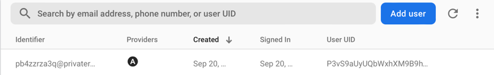

##### User Collection

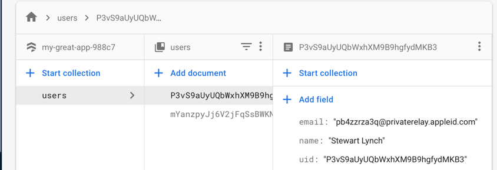

### Forgot Password

If you signed up with the **email/password** option and forget your password you can tap on the **Forgot Password** button.  You will be taken to the next screen where you can enter the email address that you used when you signed up and tap on **Reset**.

You will shortly receive an email notification from Firebase with instructions to click on a link to reset your password.

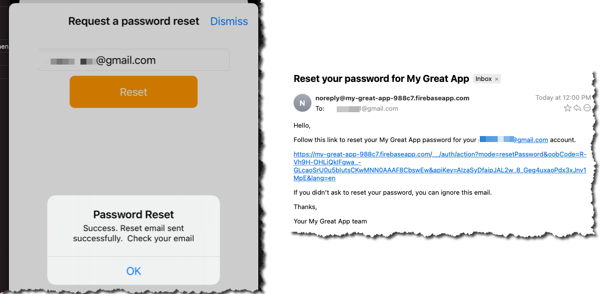

After submitting the new password, you will be able to log in using that new password.

## Profile

A **profile** view is available.  On this view you will be able to **update the** **name** that was provided when or **delete the account** entirely from Firebase.  This is a requirement for all iOS applications so make sure that you do this.

### Add a Profile Button

You need to first add a profile button to your application.  I suggest you do this on your Home view somewhere like the navigation bar.  For testing purposes I am going to add it as a button as part of the VStack.  The action on this button will toggle an @State boolean property that will initiate a modal sheet which will be the **ProfileView**.

1. Create an @State property

`````swift
@State private var showProfile = false
`````

2. Create the button that will toggle this state.  In my case, I will add this after the Logout button.

`````swift
Button {
    showProfile.toggle()
} label: {
    Text("Show Profile")
}
`````

3. Present the ProfileView as a sheet.

`````swift
.sheet(isPresented: $showProfile) {
    ProfileView()
}
`````

Running the app and tapping on that button will display the Profile Screen


### Update user name

You can enter a new **Full Name** and tap on the **Update** button.

When you do so, your will be returned to the calling view and in our testing app, the Text View will reflect your updated name.  Tapp on the **Show Profile** button once more and you will see that update on the Profile screen.

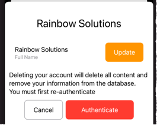

If you log in to your Firebase console and the **Firebase Firestore** tab > users > the id for that user, you will see the name has been updated there too.


### Delete Account

To **delete** an account entirely, you need to access the profile and **reauthenticate** with Firestore.  This will prevent someone from accessing your unlocked phone, opening the app and deleting your account without your permission.

#### Email/Password

If you have signed in using email/password, when you tap on the **Authenticate** you will be asked to enter your password and you will be returned to a shortened profile view where you are asked to confirm.

Tap on **Delete Account** to delete the authentication record and the corresponding user collection.

Upon completion, you will be taken to the login screen and will no longer be able to log in using that account

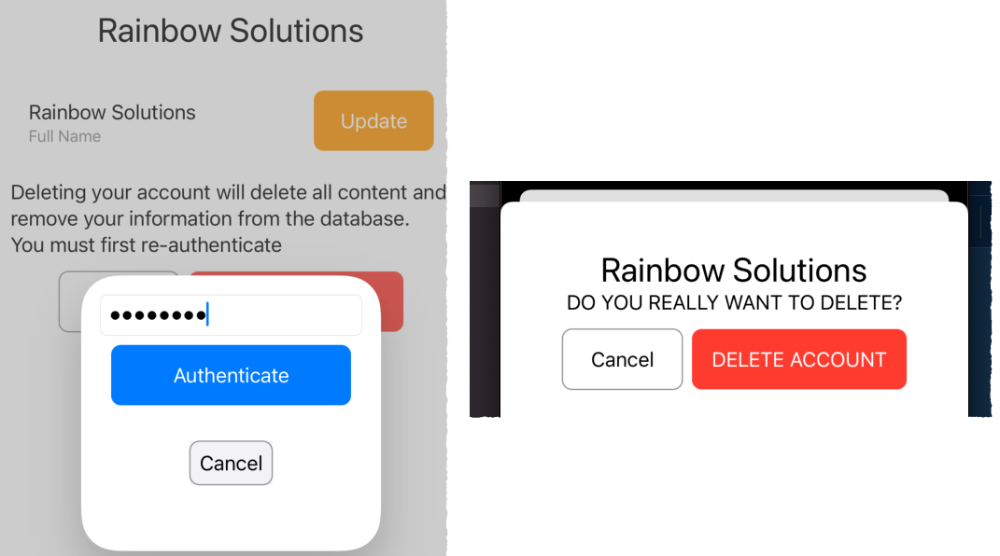

#### Apple

If you signed in with apple, upon tapping the **Authenticate** button you will be asked to **Continue with Apple** and then be taken to the same screen where you are asked to confirm.

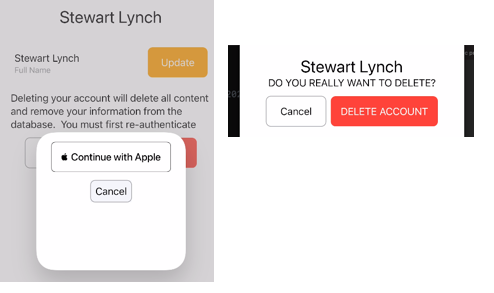

#### What gets Deleted?

This solution ***only deletes the authentication entry***, preventing the user from logging in again.

If they create a new account, it will not be linked to any existing Firestore documents (like the entry in the users collection.)

You could clone this framework as I show in this video https://youtu.be/7rFPvj7yu4Q, and discuss below in the *Modifying the Package Section* and then add additional functionality to the appliction that will preform those tasks.

For example, I have created a function in the FBFirestore.swift file named *deleteUserData* that will delete the users's corresponding document in the *user*s collection.  To use this, you would have to modify the ProfileView's Delete account button's action to call that function prior to deleting the user.  This would look like this:

`````swift
Button(canDelete ? "DELETE ACCOUNT" : "Authenticate") {
    if canDelete {
        FBFirestore.deleteUserData(uid: userInfo.user.uid) { result in
            presentationMode.wrappedValue.dismiss()
            switch result {
            case .success:
                FBAuth.deleteUser { result in
                    if case let .failure(error) = result {
                        print(error.localizedDescription)
                    }
                }
            case .failure(let error):
                print(error.localizedDescription)
            }
        }
    } else {
        withAnimation {
        providers = FBAuth.getProviders()
        }
    }
}
`````

However, this is not really a great solution because you might haved multiple sub collections or additional items stored in Firebase Storage connected to this user.

A better solution is to install the Firebase extension *Delete User Data* - https://firebase.google.com/products/extensions/delete-user-data

### Delete User Data Extension

With this extension installed, you can configure it to delete all connected collections and storage items that are connected to the account being deleted.

The caveat is that you need to be on at least the [Blaze (pay as you go) plan](https://firebase.google.com/pricing).

Once you have this established for your Firebase account and project, you can use the console to install the extension.

> Before you install the extension, ae sure that you haveset up Cloud Firestore and and Cloud Storage in your project.
>
> Also make sure that you've set up Firebase Authentication to manage your users.

#### What can you configure?

With it installed, you can configure:

- Cloud Functions location
- Cloud Firestore paths
- Cloud Firestore delete mode
- Realtime Database instance
- Realtime Database paths
- Cloud Storage paths

You can follow the instructions provided on the documentation page ( https://firebase.google.com/products/extensions/delete-user-data) to install the extension.  It is very straight forward.

In the case of this sample application, the only thing I had to configure was the path to the users collection in cloud Firestore.  Each document in the users collection is identified by the UID of the user.

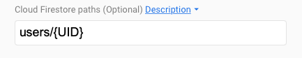

#### Confirm Account Removal

With the extension installed, once a user has been deleted, the corresponding document in the users collection is also removed.

You can log in to the Firebase console to confirm that the account(s) have been removed entirely from the **authentication** tab and from the **Firebase Firestore** user collection.

## Custom Colors and icons

The basics have now been explained and you can use this swift package on any of your own projects.  There are some additional things that you can do however, and that is to change the color of the buttons and the image that is displayed on the Login Screen.

### Adding Colors and a Login view image

When you present the **LoadingView**, you have the ability to specify a primaryColor, secondaryColor and logoImage. Similarly, when you present the Profile screen, you can choose your primaryColor for the button as well.

The buttons used on the **sIgn in**, **sign up** and **forgot password** screens are all use the same primaryColor and secondaryColor choices made on the LoadingView.

If none are used, the primaryColor is **.systemBlue** and the secondaryColor is **.systemOrange**

The image on the login defaults to a custom image.

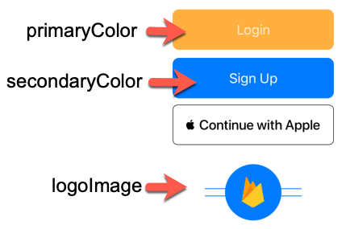

#### logoImage

The logoImage should be can be any image, but it will be **scaled to fit** within a frame of **120 X 120** and should be uploaded to your application's **Assets.xcassets** folder.

#### primaryColor and SecondaryColor

You can specify colors any way you like, but make sure that the colors look good in both light and dark mode.  The text within the buttons will always be white.

In this example, I have created an Image and two color assets and I named the color assets the same as my two argumentNames

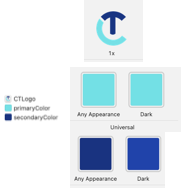

#### LoadingView

With your image and optional color assets added, you can use one, two or all three in your arguments for LoadingVIew after the title, if you leave one out, the default will be used.

At the same time, you can enter a different name for the **title**.  The **secondaryColor** is the one used for the title.

`````swift
LoadingView(startView: MyStartView(),
            title: "CreaTECH Login",
            primaryColor: UIColor(named: "primaryColor")!,
            secondaryColor: UIColor(named: "secondaryColor")!,
            logoImage: Image("CTLogo")
)
`````

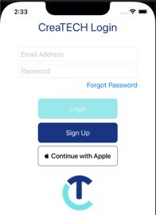

#### ProfileView

Similarly, you can pass in a primary color as an argument when presenting the ProfileView as a sheet.

`````swift
.sheet(isPresented: $showProfile) {
   ProfileView(primaryColor: UIColor(named: "primaryColor")!)
}
`````

## What Firebase Modules are installed

Normally, when you install Firebase using Swift Package manager, you specify which Firebase modules you want to include in your install.  FBAuthentication uses the following:

* FirebaseAuth
* FirebaseFirestore
* FirebaseFirestoreSwift-Beta

If your application is going to use additional modules such as FirebaseAnalytics or FirebaseStorage, you will have to install the Firebase package and select these additional product modules and make sure that if you are using the Firebase Delete Data extension that you configure the paths accordingly.

## Modifying the package

If you want to modify the functions in the package, you are going to have to download it and install it locally.

Currently, if you drill down into the Package dependencies and try to edit one of the files, you will find that this is not possible.

What you can do is go to the package repository and download it so that you can install it as a local package.

For example:

1. Open your project and display the Package Dependencies in your app.

If you double click on FBAuthentication, you will be able to copy the URL.

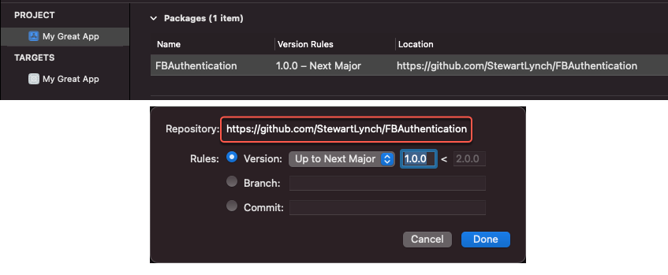

2. Remove the package from your application.

3. Open your web browser and go to the copied URL for this swift package and download the code as a Zip file

   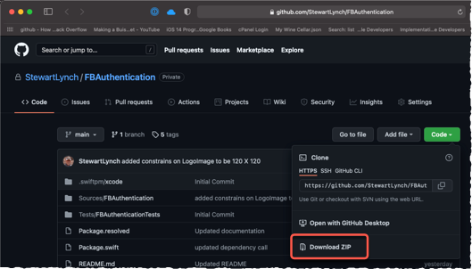

4. Locate and expand the ZIP archive if necessary and and you don't have to remove the -main suffix but if you like, you can rename it as **FBAuthentication** instead of **FBAuthentication-main** then drag it into the same folder as your **xcodeproj** file.

   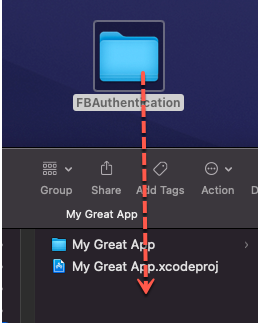

5. Drag the folder into the project navigator.  This will add the package as a local framework and will also create all of the package dependencies 

   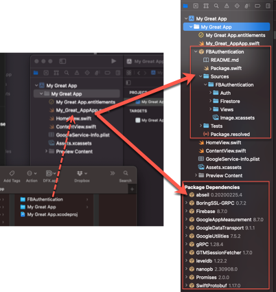

6. Select your project **target** and the **General** tab and in the **Frameworks, Libraries and Embedded Content** section click on the `+` button to add this as a framework.
7. Select **FBAuthentication** and click on **Add**

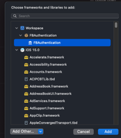

If you run your app once more, you will find that it executes exactly the same as it did before.  The difference is that now, you own the framework and can modify or add to the content.

> **Note:** Make sure that if you are going to have to access classes, structs, properties or methods from outside of the framework, you are going to have to make them **Public**.
